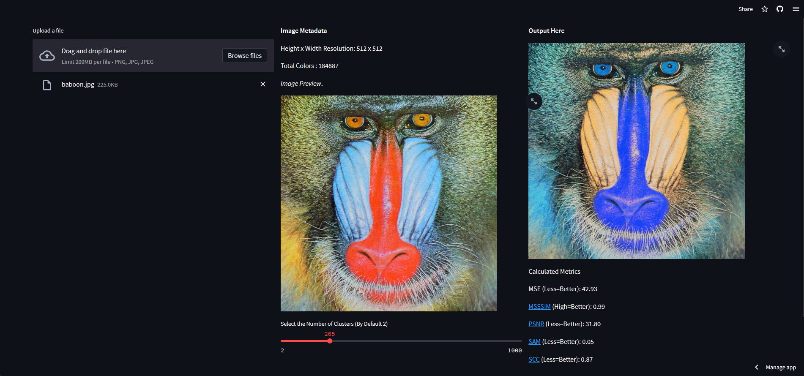

<br/>
<p align="center">
  <h3 align="center">KMeans Quantization</h3>

  <p align="center">
    Reduce Colors in Any Image!!
    <br/>
    <br/>
    <a href="https://kmeans-quantization.streamlit.app">Try Here</a>
    .
    <a href="https://github.com/Gurneet1928/Kmeans-quantization/issues">Report Bug</a>
    .
    <a href="https://github.com/Gurneet1928/Kmeans-quantization/issues">Request Feature</a>
  </p>
</p>

      

## Table Of Contents

* [About the Project](#about-the-project)
* [Built With](#built-with)
* [Getting Started](#getting-started)
  * [Prerequisites](#prerequisites)
  * [Installation](#installation)
* [Usage](#usage)
* [Metrics](#metrics)
* [Contributing](#contributing)
* [License](#license)
* [Authors](#authors)
* [Acknowledgements](#acknowledgements)

## About The Project



A simple 8-bit RGB image is capable of showing 16.7 million colors. This is possible to due each color space - Red, Green and Blue carrying 2 to the power 8 colors. This means a total of 2 to the power 24 colors. 

However, when looking at the RGB wheel of 16.7 million colors, there are many colors which looking visually similar to eyes but have different RGB composition. Color quantization helps to reduce these not so significant colors by processing and collecting only dominant colors over a region. This can be called clustering of colors.

The method used for clustering is simple KMeans. However, in order to speed-up, MiniBatchKMeans was used from the scikit-learn library.

## Built With

The KMeans Quantization Model was built using the following components:

* [MiniBatchKMeans (Scikit-Learn)]( https://scikit-learn.org/stable/modules/generated/sklearn.cluster.MiniBatchKMeans.html)
* [Streamlit (For GUI)](https://streamlit.io/)
* [Streamlit Cloud (For Hosting)](https://streamlit.io/cloud)
* [SEWAR (For Metrics)](https://pypi.org/project/sewar/)

## Getting Started

A full fledged running variant of the project is deployed on Streamlit Cloud. You can run it by clicking on this [here](https://kmeans-quantization.streamlit.app/)
 
If the project is in sleeping mode, please give it a few seconds to bake again and then run.


### Prerequisites

To install and run this project on local machine, you can run the following steps:

### Installation

1. Clone the repo

```sh
> git clone https://github.com/Gurneet1928/Kmeans-quantization.git
```

2. Make sure to run **requirements.txt** before continuing.

```sh
> pip install -r requirements.txt
```

3. Run the Application from Command Prompt in the same folder.

```sh
> streamlit run app.py
```

## Usage

In order to use the project, follow the steps:

- Upload Any image using the **Upload** button
- Select any number of clusters using the slider at the middle bottom of the screen (By Default 2)
- Output is Generated on the right panel and you can right-click it to save it.

## Metrics

To find the difference between the original and Quantized image, the project uses 5 metrics from **SEWAR** library:
- Mean Squared Error (MSE) (Less=Better)
- Multi-scale Structural Similarity Index  (MSSSIM) (High=Better)
- Peak Signal-to-Noise Ratio (PSNR) (Less=Better)
- Spectral Angle Mapper (SAM) (Less=Better)
- Spatial Correlation Coefficient (SCC) (Less=Better)

## Contributing

This project and its author are always on the lookout for Contributors. Do you have something to add? Can You improve the project? Maybe I missed something?
Then always feel free to contact the author or just raise a Pull Request and I will Look into it.

### Creating A Pull Request

1. Fork the Project
2. Create your Feature Branch (`git checkout -b feature/AmazingFeature`)
3. Commit your Changes (`git commit -m 'Add some AmazingFeature'`)
4. Push to the Branch (`git push origin feature/AmazingFeature`)
5. Open a Pull Request

## License

This project was made under MIT License. Hence, you are free to use, replicate or do whatever you want to do with it (HELL YEAH!!!!!!)

## Authors

* **Gurneet Singh** - *AI/ML Student* - [Github Profile](https://github.com/Gurneet1928) - *Main+Sole Project Builder*

## Acknowledgements

* [ShaanCoding](https://github.com/ShaanCoding/)
